# Java-Final-Project

###### **关于七个从葫芦里蹦出来的超能力儿童为了拯救爷爷在葫芦山和被蝎子和蛇领导的一群妖魔鬼怪大战八百回合打得难舍难分的那些事**


> 作者：符嗣仟，谢靓静
>
> 联系方式：463546179@qq.com  jillianxie@qq.com

---


## 一、游戏介绍

### 1. 故事背景

前几日来了一个云游道士，眼虽失明，却能在这山间自由来去。道士在村中逗留几日，整日神神叨叨，时常叫嚷着：“劫数啊，都是劫数啊”。有人问他，他又闭口不言，只是笑笑，又从嘴里挤出一点“天机不可泄露”、“葫芦”之类的胡话，过几日便再寻不见那道士，只是有天觉得地动，蛇鼠蝙蝠便向那处聚集，村中开始有鸡鸭失踪，人心惶惶。再过几日，村中一白发老者也不见踪影，人们发现他栽种的七颗葫芦也消失不见......

此时葫芦兄弟已经和妖精摆好了阵型，大战一触即发！

### 2. 操作说明

首先需要运行服务器，入口为：**server.game.Server**

服务器运行成功之后，两方玩家即可开始运行游戏，入口为：**client.game.Main**


在客户端启动游戏之后，首先看到的是登陆界面，如下图所示。

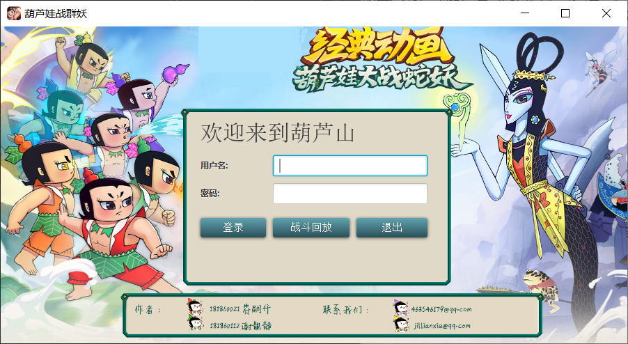

* **登录按钮**：由于现阶段没有涉及数据库，玩家可输入任意用户名(两方玩家需要输入不同的用户名，是否输入密码可选)，点击登录开始游戏。
* **战斗回放**：如果在之前完整执行游戏之后保存过回放文件(*.hulu)，此时单击战斗回访按钮，在弹出的文件选择窗口中选择保存过的文件，即可在新弹出得窗口中观看战斗回放，回放结束后该窗口将自动关闭。
* **退出**：放弃登录，结束程序的运行。


成功登陆游戏之后，将进入游戏大厅，如下图所示。

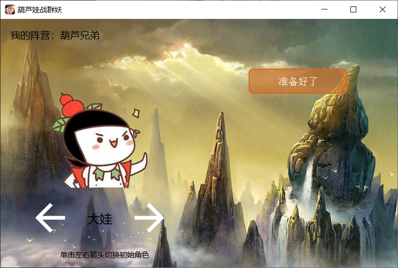

* **我的阵营**：成功登陆的玩家将被服务器随机分配进入一个阵营。在游戏大厅界面上，玩家将可以看到自己被分配到的阵营。
* **左右箭头**：玩家可以通过单击左右箭头切换自己控制的初始角色，不同角色具有不同的特殊技能和初始属性，技能由玩家控制释放。
* **准备好了**：当玩家选择好自己控制的角色之后，单击准备好了按钮，若对方玩家尚未完成选择，将进入如下图所示的等待页面；若对方玩家已经在等待过程中，将直接开始游戏。

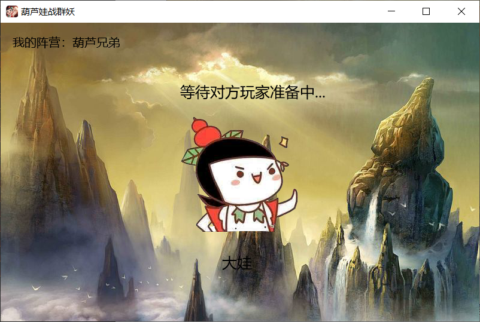

游戏正式开始运行，地图如下：

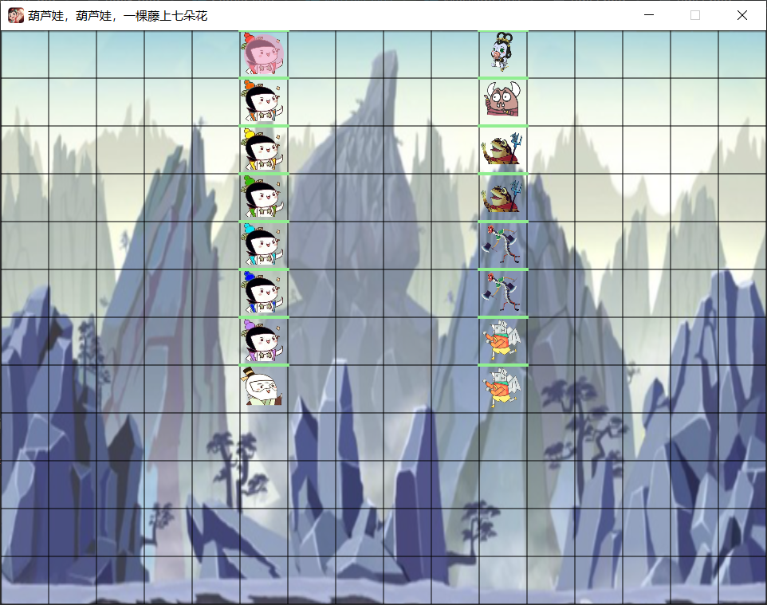


* **我的角色**：当前被玩家控制的角色脚下有圆形粉红色标记。
* **人物移动**：未被玩家控制的角色依照算法自动移动；被当前玩家控制的角色通过按下键盘方向键   ↑：向上移动一格  ↓：向下移动一格 ←：向左移动一格 →：向右移动一格，控制移动。
* **发射子弹**：未被玩家控制的角色依照算法自动发射子弹；被当前玩家控制的角色通过按下键盘字母键   W：向上发射子弹  S：向下发射子弹  A：向左发射子弹  D：向右发射子弹。
* **切换角色**：玩家通过按下键盘字母键 Q：向左切换角色 E：向右切换角色 (此处左右逻辑与游戏大厅切换顺序保持一致)。
* **发射技能**：玩家通过按下键盘字母键 F：发射角色技能，玩家只能触发自己当前正在控制的角色的技能。技能效果和允许触发的条件见生物设计模块。


当一方玩家突然中止游戏或一方玩家阵营内的角色全部死亡时，游戏结束，结束界面如下：

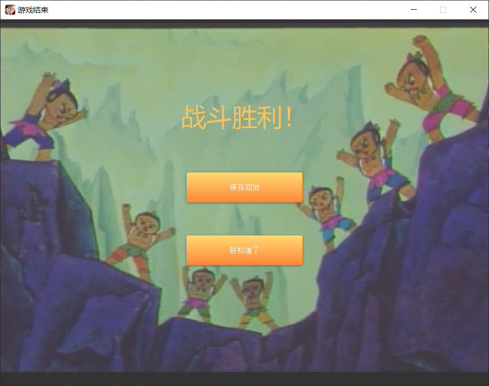

* **保存回放**：若玩家想要保存此次游戏记录，单击该按钮将弹出文件保存框，选择路径和文件名称后后将保存为*.hulu文件，默认文件名为replay.hulu。重启游戏后即可选择回放文件并观看。
* **朕知道了/下次再战**：结束本次游戏。


### 3.游戏展示

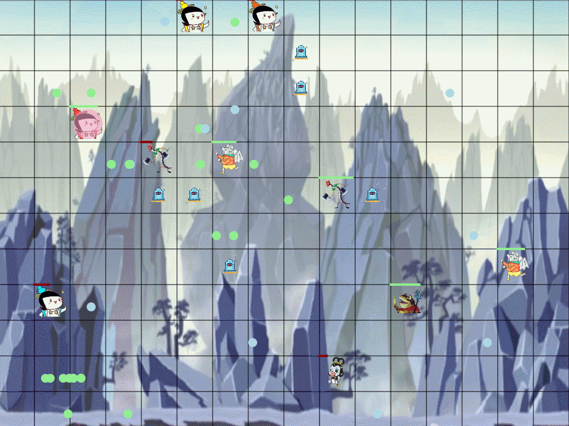

---

## 二、游戏设计


#### 关键词

* 多线程

* 网络通信

* JavaFx

* Maven

* 双人对战

* 战斗复现

  

### 1.项目框架

在项目框架的搭建过程中，我们主要进行了两个版本项目框架的迭代。

第一代版本设计中，Server端只负责消息的接收与转发，所有的战场逻辑，用户交互，GUI等都在Client端进行操作；这种结构设计主要参考课程群中：[Java实现简易联网坦克对战小游戏](https://www.cnblogs.com/tanshaoshenghao/p/10708586.html#tanknewmsg) ；而又由于多线程设计时，每个生物均单独作为一个线程存活，因而在开发过程中遇到了以下问题：

* 为了保证多线程安全，凡是用到共享变量的地方，均需要进行上锁，极大降低了游戏的运行速度
* Client端线程池中存在的线程有：若干生物线程、子弹控制线程、JavaFX绘图线程、消息收发线程。而消息收发线程与本地生物共享消息队列，即出现抢占饥饿问题，生物线程抢占消息队列而导致消息收发线程无法向其中存入消息，游戏难以正常进行。我们也尝试过使用 wait, notify操作（PV操作）进行处理，效果不佳。
* JavaFX并非线程安全的操作。在屏幕上战斗元素逐渐丰富的过程中，便有可能出现多线程并发问题导致程序崩溃。

**Version 2.0:**

在第二版的设计中，我们将游戏逻辑运算移植到 **server端** ，这也是当下大多数游戏所采用的逻辑，而将 **Client端** 所涉及的操作尽可能的减少，在保证了JavaFX的线程安全性的同时，避免了死锁或饥饿等问题。

 **Client**

**功能：** Client端主要负责消息收发，用户交互，回放操作，登录界面以及战场的绘制。

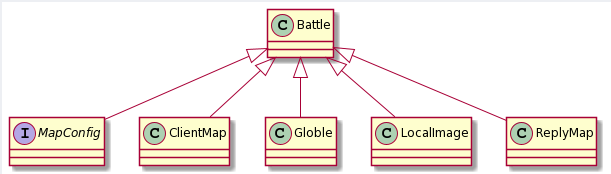

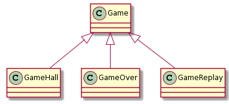

**模块介绍**

| 模块名称   | 模块作用                     |
| ---------- | ---------------------------- |
| Mapconfig  | 通过接口类存储宏定义         |
| ClientMap  | 战场绘制以及信息收发         |
| Globle     | 部分变量存储                 |
| LocalImage | 本地图片url初始化            |
| ReplayMap  | 用于回放操作                 |
| GameHall   | 游戏大厅设计以及用户鼠标交互 |
| GameOver   | 游戏结束界面设计             |
| GameReplay | 回放按钮实现                 |

 **Server**

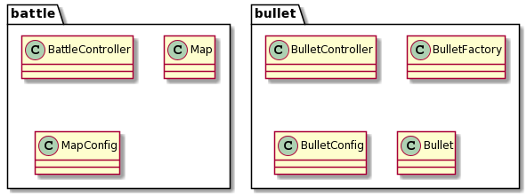

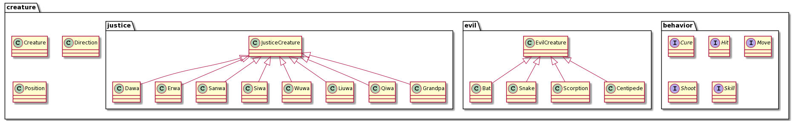

| 模块名称         | 模块功能               |
| ---------------- | ---------------------- |
| BattleController | 战斗逻辑控制           |
| Map              | 战场信息存储           |
| MapConfig        | 地图参数存储           |
| BulletController | 子弹行为控制线程       |
| BulletFactory    | 子弹工厂，用于子弹生成 |
| BulletConfig     | 子弹参数               |


### 2.生物设计

| 生物   | 生物特性                                                     |
| ------ | ------------------------------------------------------------ |
| 爷爷   | 心灵港湾：在以爷爷为中心九宫格内的葫芦娃们的受到治愈         |
| 大娃   | 力大无穷：攻击为其他葫芦娃的两倍                             |
| 二娃   | 千里眼：每攻击五次，技能冷却结束，对蛇精或蝎子精造成精准伤害 |
| 三娃   | 铜墙铁壁：防御高，攻击低（作用主要为挡子弹和刮痧，每次只能打普通葫芦娃1/2的伤害，受到普通葫芦娃1/2的伤害 |
| 四娃   | 火焰燎原：每攻击五次，技能冷却结束，最上方出现一排向下攻击的子弹 |
| 五娃   | 水漫金山：每攻击五次，技能冷却结束，最左方出现一排向右攻击的子弹 |
| 六娃   | 凌波微步：移动与攻击速度为其他葫芦娃的两倍                   |
| 七娃   | 叫你一声你敢答应吗：秒杀对方蜈蚣精/蛤蟆精/蝙蝠精【一局使用一次】 |
| 蛇精   | 周围角色治愈以及增加攻击力防御力                             |
| 蝎子精 | 每攻击10下，积累技能，对所有葫芦娃造成伤害                   |
| 蜈蚣精 | 喽啰妖精平均属性为葫芦娃的1.5倍                              |
| 蛤蟆精 | 喽啰妖精平均属性为葫芦娃的1.5倍                              |
| 蝙蝠精 | 喽啰妖精平均属性为葫芦娃的1.5倍                              |


### 3.图形化实现

图形化采用了JavaFx框架，采取事件驱动的程序设计，在GameHall中实现对用户操作信号的响应，实现了可交互。

**界面初始化**

玩家入口client.game.Main实现了Application接口，首先加载Login.fxml构建登录窗口，并执行初始化工作。

~~~java
Parent root = FXMLLoader.load(getClass().getResource("../../Login.fxml"));
Scene scene = new Scene(root, 900, 455);
primaryStage.setTitle("葫芦娃战群妖");
primaryStage.setScene(scene);
primaryStage.getIcons().add(new Image(url));
primaryStage.show();
~~~

**界面切换**

登陆界面至游戏大厅的切换。在登录按钮的信号相应函数中，执行setGameHall方法，在setGameHall方法中，创建所需要的若干组件，设置组件的位置和版式内容，重置当前Stage。最后重新显示窗口，即实现了一次界面切换。

~~~java
private void setGameHall(ActionEvent actionEvent){
        Text camp, role, introduction;
    	Button bu1 = new Button();
        Button bu2 = new Button();
        Button ready = new Button("准备好了");
        StackPane sp = new StackPane();
    	HBox hbox = new HBox();
    	root = new AnchorPane();
    
    	填写组件内容和设计版式

        sp.getChildren().addAll(hbox);
 		root.getChildren().addAll(sp, role, bu1, bu2, ready, replay, camp, introduction);

        Scene scene = new Scene(root);
        gameHallStage = (Stage) ((Node) actionEvent.getSource()).getScene().getWindow();
        
        gameHallStage.hide();
        gameHallStage.setScene(scene);
        gameHallStage.show();
}
~~~

登陆界面到回放窗口的切换。由于回放需要在新窗口中显示，传入绘图方法的参数应为一个新的Stage。

~~~Java
new GameReplay(new Stage());
~~~

游戏大厅到游戏界面的切换。将当前的PrimaryStage作为参数传入Game的构造函数，在其中执行初始化工作，并重新显示Stage。具体游戏信息将在ClientMap中根据游戏状态在合适的位置绘制。

~~~Java
Group root = new Group();
Canvas canvas = new Canvas(MAPWIDTH,MAPHEIGHT);
GraphicsContext gc = canvas.getGraphicsContext2D();
root.getChildren().add(canvas);
Scene scene = new Scene(root);
primaryStage.setScene(scene);
primaryStage.show();
ClientMap.gc = gc;
ClientMap.canvas = canvas;
ClientMap.scene = scene;
ClientMap.stage = primaryStage;
~~~

游戏进行到游戏终止界面的切换。客户端收到需要中止游戏的通知时，将根据游戏结果，加载不同的fxml文件，重新显示界面。以葫芦娃获胜，在控制葫芦娃的玩家一侧的显示为例。

~~~Java
if(WinnerName && Globle.chosen_id < 8){
	Parent root = FXMLLoader.load(getClass().getResource("HuluWin.fxml"));
    Scene scene = new Scene(root, 960, 720);
    primaryStage.setTitle("游戏结束")
    primaryStage.setScene(scene);
    String url = Objects.requireNonNull(this.getClass().getClassLoader().getResource("Pics/Icon.png")).toString();
    primaryStage.getIcons().add(new Image(url));
    primaryStage.show();
}
~~~

**重写窗口关闭信号处理函数**

由于玩家可能在游戏过程中突然点击右上角关闭键关闭窗口，所以需要重写该信号处理函数，执行输入输出流的关闭和结束所有线程。

~~~Java
gameHallStage.setOnCloseRequest(arg0 -> {
	try {
    	Globle.client_inf.close();
        Globle.client_out.close();
        Globle.socket.close();
    } catch (IOException e) {
        e.printStackTrace();
    }
    System.exit(-1);
});
~~~

**在非Fx线程执行Fx线程相关的任务**

在 JavaFx 中，如果在非Fx线程要执行Fx线程相关的任务，必须在Platform.runlater中执行。

~~~java
new Thread(() -> {
           	
           	......
           	
            Platform.runLater(() -> {
                gameHallStage.hide();
                new Game(gameHallStage);
            });
        }).start();
~~~


### 4.网络通信

**通信协议(Message)**

通信双方接收到Message后首先读取消息类型，再根据不同的消息类型设置/提取参数。

-1: 空消息
 0: 客户端向服务器发送登陆成功的消息
 1: 玩家按下了准备键
 2: 玩家按下了键盘按键
100: 登录确认
101: 双方准备完成
102: 转发地图信息
103: 角色切换消息

~~~java
public class Message implements Serializable {
    public int MessageType = -1;     //消息类型
    public int srcId = -1;           //发出消息的角色
    public KeyCode KEYCODE;          //键盘码
    public String UserName = null;   //用户名
    public String KindName = null;   //控制葫芦娃一方的用户名
    public boolean WinnerName = true;//是否为葫芦娃一方获得胜利
    public ArrayList<Boolean> creature_status = new ArrayList<>();    //生物状态信息
    public ArrayList<Integer> creture_position_X = new ArrayList<>(); //生物位置X坐标
    public ArrayList<Integer> creture_position_Y = new ArrayList<>(); //生物位置Y坐标
    public ArrayList<Integer> creature_max_hp = new ArrayList<>();    //生物最大血量
    public ArrayList<Integer> creature_current_hp = new ArrayList<>();//
    public ArrayList<Boolean> bullet_camp = new ArrayList<>();
    public ArrayList<Double> bullet_position_X = new ArrayList<>();
    public ArrayList<Double> bullet_position_Y = new ArrayList<>();
    public int skill1 = 0;
    public int skill2 = 0;
    public int skillId1 = -1;
    public int skillId2 = -1;
}
~~~


**服务器(Server)**

Server类存储了一系列变量，主要包括：

~~~java
private static ServerSocket server; //服务器Socket
private Socket clientsocket;        //接收到的客户Socket
public static Hashtable ht_out = new Hashtable();   //键码为clientsocket，键值为ObjectOutputStream
public static Hashtable htPlayer = new Hashtable(); //键码为玩家姓名，键值为clientsocket
protected ObjectInputStream inf; 
protected ObjectOutputStream out;
public static int number = 0; //已经处于准备状态的玩家数量
public static int connection_num = 0; //与服务器成功连接的客户端数量
public static int period = 0; //游戏所处的阶段，1表示游戏进行中
public static String KindDecided = null; //服务器决定的控制葫芦娃一方的名称
public static Integer chosen_id1 = 0; //葫芦娃一方当前控制的角色编号
public static Integer chosen_id2 = 8; //妖精一方当前控制的角色编号
public static ConcurrentLinkedQueue<Message> message_queue1 = new ConcurrentLinkedQueue<>(); //与葫芦娃一方进行交互的消息队列
public static ConcurrentLinkedQueue<Message> message_queue2 = new ConcurrentLinkedQueue<>(); //与妖精一方进行交互的消息队列
~~~

服务器启动之后，将进入一个循环，接收来自client的连接。对每个接收到的连接，新建一个ServerThread线程与其进行交互和处理。

~~~Java
server = new ServerSocket(8888);
System.out.println("<---- 服务器已启动 ---->");
while (true) {
    clientsocket = server.accept();
    System.out.println("<---- 收到连接：" + clientsocket.toString() + "---->");
    wlock.lock();
    connection_num++;       
    wlock.unlock();
    inf = new ObjectInputStream(clientsocket.getInputStream());
    out = new ObjectOutputStream(clientsocket.getOutputStream());
    ht_out.put(clientsocket, out);
    System.out.println(ht_out);
    ServerThread serverThread = new ServerThread(clientsocket, ht_out, out, inf);
    Thread thread = new Thread(serverThread);
    thread.start();
    ......
}
~~~

在ServerThread的run方法中，针对每个接受到的消息进行处理，并构造返回给客户端的message。最后将returnMessage广播给当前连接的所有客户端。

~~~java
while (true) {
	//获取发送来的消息
    synchronized (out) {
    	receivedMessage = (Message) inf.readObject();
    	System.out.println("get message from client");
    }
	//获得返回消息
    returnMessage = processMessage(receivedMessage, clientsocket);
    if (receivedMessage.MessageType == -1) continue;
	if (!Server.htPlayer.isEmpty()) {
    //向其他玩家转发
    	synchronized (ht_out) {
        	for (Iterator it = ht_out.keySet().iterator(); it.hasNext(); ) {
            	System.out.println("sending to player");
                Socket key = (Socket) it.next();
                ObjectOutputStream outData = (ObjectOutputStream) ht_out.get(key);
                InputStream inData = key.getInputStream();
                synchronized (inData) {
                	outData.writeObject(returnMessage);
                }
        	}
      	}
    }
}
~~~


**客户端**

客户端需要接受服务器发送给客户端的消息，其中一部分包含了当前地图信息。在客户端负责消息接手的线程中，首先需要更新MapMessage的值，之后将在绘图线程中对该Message进行解析。

~~~Java
while (true) {
	if(Globle.socket.isClosed()) break
    //获取发送来的消息
    try {
    	synchronized (Globle.client_out){
    		message = (Message) Globle.client_inf.readObject();
    	}
    } catch (java.net.SocketException e) {
    	System.out.println("ClientSocket has closed");
        break;
  	}
    if (message.MessageType == 102) {
        Globle.map_message = message; // 更新map_message
    } else if (message.MessageType == 103) {
        ......
    }
}
~~~

客户端也需要发送给服务器包含特定信息的Message。在按钮的响应函数中，client需要在用户点击按钮时发送特定的消息给服务器。

~~~java
//向服务器发起连接
private boolean connect() throws IOException {
        Globle.socket = new Socket("192.168.43.210", 8888);
        Globle.client_out = new ObjectOutputStream(Globle.socket.getOutputStream());
        Globle.client_inf = new ObjectInputStream(Globle.socket.getInputStream());
        Message message = new Message();
        message.MessageType = 0;
        message.UserName = Globle.name;
        synchronized (Globle.client_inf){
            Globle.client_out.writeObject(message);
        }
        return true;
}

//告知服务器该玩家已经做好准备
public void handleReadyButtonAction(ActionEvent actionEvent){
	 	if(!Globle.kind){
            Globle.chosen_id += 8;
        }
        Message message = new Message();
        message.MessageType = 1;
        message.srcId = Globle.chosen_id;
        try {
            synchronized (Globle.socket.getInputStream()){
                Globle.client_out.writeObject(message);
            }
        } catch (IOException e) {
            e.printStackTrace();
        }
    ......
}

//向服务器发送键盘消息
Message message = new Message();
 	message.MessageType = 2;
    message.KEYCODE = keycode;
    message.srcId = Globle.chosen_id;
	synchronized (Globle.client_inf) {
    try {      	
        Globle.client_out.writeObject(message);
     } catch (IOException e) {
        e.printStackTrace();
     }
}
~~~


### 5.多线程

#### 多线程设计

**游戏逻辑：**

在游戏逻辑处理模块，我们将线程主要分为三类：生物、子弹、JavaFX绘图线程；最终将这些线程放入 `CacheThreadPool` 中，采用`CachedThreadPool` 的原因是：它是一个无界线程池，可以进行自动线程回收。

```java
//TODO: 线程池完成游戏进行
public void GameStart() {
	cachedThreadPool = Executors.newCachedThreadPool();
    cachedThreadPool.execute(map);
    for (JusticeCreature justiceCreature : justiceCreatures) {
    	cachedThreadPool.execute(justiceCreature);
    }
    for (EvilCreature evilCreature : evilCreatures) {
        cachedThreadPool.execute(evilCreature);
    }
    cachedThreadPool.execute(bulletController);
}
```

**生物**

```java
@Override
public void run() {
    while (true){
    synchronized (Server.chosen_id1) {
    	if (id == Server.chosen_id1){
        	IsPlayer = true;
            synchronized (Server.message_queue1){
            if (Server.message_queue1.isEmpty()==false){
            	Message message = Server.message_queue1.remove();
                if(message.MessageType==2){
                	KeyCode keyCode = message.KEYCODE;
                    try {
                    	handle(keyCode,true);
                    } catch (IOException e) {
                        e.printStackTrace();
                    }
       ......
```

每个生物类  **implements runnable 接口** 我们将每个生物单独看作一个线程，进行对应的战斗逻辑处理。

**子弹**

对于子弹而言，我们采用一个线程统一控制子弹的移动、越界、击中等行为处理。

**JAVAFX**

```java
    @Override
    public void run() {
        scene.setOnKeyPressed(new KeyBoardHandler());   //键盘监听
        while (true) {
            Globle.wlock.lock();
            try{
                if(!Globle.IsStarted)
                    break;
            }
            finally {
                Globle.wlock.unlock();
            }
            //背景
            gc.drawImage(getBackground(), 0, 0, MAPWIDTH, MAPHEIGHT);
```

**消息处理逻辑：**

在Server中针对每个连接的客户端创建ServerThread进行处理。

Client.game.Game中创建用于接收服务器返回消息的线程。

Client.game.GameHall中对"准备好了"按钮的响应方法中，新建一个等待线程，等待服务器通知可以开始游戏。


### 6.设计模式

**工厂设计模式**

一个工厂中有各种产品，客户无需知道具体产品名称，只需要知道其参数。在本次项目实现中，我们对于子弹采取工厂模式进行生成。

```java
public class BulletFactory implements Serializable {
    //简单工厂模式
    //发射者传入当前自身坐标，阵营，根据键盘输入确定
    public Bullet getBullet(double x, double y, Direction direction, boolean camp, int damage, int send_id){
        return new Bullet(x,y,direction,camp,damage,send_id);
    }
}
```


## 三、面向对象

### 1.封装

封装是指一种将抽象性函式接口的实现细节部分包装、隐藏起来的方法。例如在Map实现中，Map上存储的生物对象不能够由外部对象直接访问，否则会增大程序耦合以及不安全性。因此在此处将战场信息设为 **private**，通过Map类给出接口，供其他类对象使用。


### 2.继承

继承就是子类继承父类的特征和行为，使得子类对象（实例）具有父类的实例域和方法，或子类从父类继承方法，使得子类具有父类相同的行为。在项目设计过程中，体现最为明显的是：

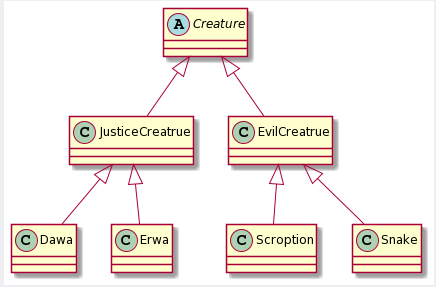

【此处仅列举部分生物】

在其中所有的生物共享生物属性，属性差异由不同生物自行修改。而所有生物都具有移动，射击，被攻击等行为，就交由`Creatrue` 或 `JusticeCreature` 实现，子类通过继承得到相应方法。

多态简而言之就是同一个行为具有多个不同的表现形式。在我们的项目实现中，将`skill`作为接口，不同生物通过实现该接口，来完成各自技能的设计。但在最后进行生物生成存储的时候，仍然是以 `Creature Dawa = new Dawa();` 形式来将父类引用指向子类对象，但是仍然可以使得子类拥有自己的方法。

在使用多态方式进行方法调用时，首先检查父类中是否有该方法，如果没有，则编译错误；如果有，再去调用子类的同名方法。多态的好处：可以使程序有良好的扩展，并可以对所有类的对象进行通用处理。


### 4.SOLID设计原则

**SRP (The Single-Responsibility Principle)**

单一职责原则，针对当类负责两个问题时，因职责P1需求改变而导致T改变，可能会对原本正常的P2产生故障。此处主要针对在初期Map的实现时，Client与Server共用一个Map，Map兼具了存储战场信息以及绘图功能，而前者改变可能会导致后者的变化，因此在此处，我们将Map功能进行拆分，在 **client端** 新设计了一个 **clientMap** ，专门用于图像绘制。

**OCP (The Open-Closed Principle)**

开闭原则，针对在软件生命周期内，由于变化、升级、维护等原因对原代码进行修改时，会给旧代码引入错误，使得不得不对代码进行重构与重新测试。

该原则主要体现在 **用抽象构建框架，用实现扩展细节。** 代码中 `creature`类作为抽象类存在，其具体生物的具体细节通过其派生类实现，从而保证了架构的稳定。

**LSP (The Liskov Substitution Principle)**

里氏替换原则，子类可以替换父类并出现在父类能够出现的地方。

该原则主要体现在 **由于通过多态使得子类覆盖并重新定义了父类的方法，为了符合LSP原则，就应该把父类定义为抽象类，定义抽象方法，而让子类重新定义这些方法。** 例如生物类的设计便是如此。

**ISP (The Interface-Segregation Principle)**

 接口隔离原则，完成接口的最小实现。将接口I 拆分成独立的几个接口，类A与类C分别与他们所需要的接口建立依赖关系。

该原则主要应用在接口定义中，例如在生物行为定义时，将接口拆分为了`MOVE`,`Shoot` `Skill` 接口等，在`Skill`接口中只定义了 `skill()` 一个方法。


## 四、实现细节

### 1.异常处理


### 2.集合类型

* **LinkedList**

  * LinkedList是一个双向列表，列表中的每个节点都对应了对前一个和后一个元素的引用。元素插入和删除快。

  * 项目应用

    * **Client:** 用于回放信息的存储

      `public static LinkedList<Message> replay_queue = new LinkedList<>();`

    * **Server:** 用于子弹，玩家移动路径的存储

      `LinkedList<Bullet> bullets = new LinkedList<>();`

* **ArrayList**

  * ArrayList是List接口的实现类，集合数据存储的结构是数组。元素增删慢但查找快。

  

### 3.注解

> Java 注解用于为 Java 代码提供元数据。作为元数据，注解不直接影响你的代码执行，但也有一些类型的注解实际上可以用于这一目的。

#### 内置注解（元注解

在此次项目中，我们所用到内置注解包括`@Override`,`@Retention`,`@Documented`,`@Target`

**@Override**

检查该方法是否是重写方法，如果发现其父类，或者引用的接口中并没有该方法时，会抱编译错误。

例如，在项目中定义了一个`interface Skill` 接口，其中有一个方法：`void skill()`

不同的生物对于接口进行 implement操作时，会重写的方法均不同，故需要采用 `@Override` 注解进行检查。

#### 自定义注解

采用以上提及内置注解中后三个注解，进行自定义注解搭建：

```java
@Documented
@Target(ElementType.TYPE)
@Retention(RetentionPolicy.CLASS)
public @interface ClassInfo {
    String CompleteTime() default "XXXX-XX-XX XX:XX:XX";  //完成时间
    String Author() default "fsq xlj";      //作者
    String Description() default "";      //类描述
}
```

该注解的作用为：简要介绍每个类的作用以及为文件打上作者和类完成时间的标签。

**@Documented**

作用为将注解中的元素包含到Javadoc中。

**@Target**

表示注解作用的范围，此处取 **ElementType.TYPE** ，表示注解作用于接口、类、枚举、注解。

**@Retention**

表示注解存在阶段是保留在编译期，类加载或者是JVM运行期。**RetentionPolicy.CLASS** 为默认的保留策略，注解会在class字节码文件中存在，但运行时无法获得。


### 4.lambda表达式

创建消息接受和处理线程

~~~Java
new Thread(() -> {...}).start();
~~~

在非Javafx线程中对界面进行操作

~~~Java
Platform.runLater(() -> {...});
~~~

重写关闭窗口

~~~java
gameHallStage.setOnCloseRequest(arg0 -> {...});
~~~


## 五、共享资源的冲突

## 五、共享资源冲突解决

#### 1. 子弹移动时上锁

子弹移动逻辑为 {击中 remove --> else: 移动 --> 出界:remove}，因此首先在移动过程中对于子弹上锁，使不能有新的子弹添加入其中。其次在判断是否击中目标时，对于map以及当前生物进行上锁，防止该生物在该帧位置突然改变的移动操作。

```java
synchronized (bullets){
	ListIterator<Bullet> iter = bullets.listIterator();
    while(iter.hasNext()) {
    	boolean isHit = false;    //判断子弹有无击中生物
        Bullet bullet = iter.next();
		...
        synchronized (map){
        	Creature c = map.getCreature(blockX,blockY);
            if(c != null){
            	synchronized (c){
                if((c.getCamp()!=bullet.getCamp())&&c.getIsalive()){
                	System.out.println(bullet.getDamage());
                	c.hit(bullet.getDamage());
                    isHit = true;   //子弹消失
   				...
```


## 六、回放操作

客户端持有一个全局变量，用于存储收到的所有message

~~~java
public static LinkedList<Message> replay_queue = new LinkedList<>();
~~~

每次收到一个新的地图信息，就将message加入到replay_queue中

~~~java
Message message = new Message();
	synchronized (Globle.map_message) {
    	if (Globle.map_message.MessageType == 102) {
    		message = Globle.map_message;
    	} else continue;
    }
Globle.replay_queue.add(message);
~~~

游戏结束时，若用户选择保存回放按钮，将message_queue的信息写入到文件中。

~~~java
FileChooser fc = new FileChooser();
fc.setTitle("选择回放文件存储路径");
fc.setInitialFileName("replay");
fc.getExtensionFilters().addAll(new FileChooser.ExtensionFilter("回放文件","*.hulu"));
File file = fc.showSaveDialog(gameHallStage);
if (file == null) return;
try {
	FileOutputStream out = new FileOutputStream(file);
    ObjectOutputStream objOut=new ObjectOutputStream(out);
    Message temp = new Message();
    while(!Globle.replay_queue.isEmpty()){
    	temp = Globle.replay_queue.removeFirst();
        objOut.writeObject(temp);
    }
    objOut.writeObject(null);
    System.out.println("回放文件存储成功！");
} catch (IOException e) {
    e.printStackTrace();
}
~~~

若用户在开始游戏前选择读取回放文件，则执行读取文件的操作，读取完成后调用绘图接口即可完成回放。

~~~java
	public void handleReplayButtonAction(ActionEvent actionEvent){
        FileChooser fc = new FileChooser();
        fc.setTitle("选择回放文件");
        fc.getExtensionFilters().addAll(new FileChooser.ExtensionFilter("回放文件","*.hulu"),
                new FileChooser.ExtensionFilter("所有类型","*.*"));
        File file = fc.showOpenDialog(gameHallStage);
        if (file == null) return;
        try {
            FileInputStream in = new FileInputStream(file);
            ObjectInputStream objIn=new ObjectInputStream(in);
            Message temp;
            Globle.replay_queue.clear();
            while((temp = (message.Message) objIn.readObject()) != null){
                Globle.replay_queue.add(temp);
            }
            System.out.println("回放文件读取成功！");
            if (gameHallStage == null){
                gameHallStage = (Stage) ((Node) actionEvent.getSource()).getScene().getWindow();
            }
            new GameReplay(new Stage());
        } catch (IOException e) {
            e.printStackTrace();
        } catch (ClassNotFoundException e) {
            e.printStackTrace();
        }
    }
~~~


## 七、测试

在此模块对于游戏的运行逻辑进行单元测试，分别测试了以下三种情况：

1. **生物移动测试**

   对于生物移动的合法性进行判断，给定一条生物移动路径，测试生物是否能够符合游戏运行逻辑的移动到目的地点；

   在移动路径上设置了 ①出界操作②生物阻拦等不能进行移动的情况

   测试代码如下：

   ```java
       @Test
       public void CreatureMoveTest(){
           LinkedList<Bullet>bullets = new LinkedList<>();
           Map map = new Map(bullets);
           Creature creature = new Dawa(map,bullets);
           creature.setPosition(0,0);
           map.setBlocks(0,0,creature);
           Creature hinder = new Erwa(map,bullets);
           hinder.setPosition(2,0);
           map.setBlocks(2,0,hinder);
           assertEquals((int)(creature.getPosition().getX()),(int)0);
           assertEquals((int)(creature.getPosition().getY()),(int)0);
           LinkedList<Direction>path = new LinkedList<Direction>(){{
               add(Direction.UP);
               add(Direction.UP);
               add(Direction.DOWN);
               add(Direction.DOWN);
               add(Direction.DOWN);
               add(Direction.RIGHT);
               add(Direction.RIGHT);
               add(Direction.LEFT);
               add(Direction.UP);
           }};
   
           for (Direction direction: path){
               creature.addPath(direction);
           }
           creature.HumanMove();
           assertEquals((int)(creature.getPosition().getX()),(int)0);
           assertEquals((int)(creature.getPosition().getY()),(int)0);
       }
   ```

2. **子弹移动测试**

   主要测试子弹 击中/出界/是否移除以及能否正常移动。

   测试代码如下：

   ```java
       @Test    
       public void BulletMoveTest(){
           BulletFactory bulletFactory = new BulletFactory();
           Bullet bullet = bulletFactory.getBullet(50,50, Direction.RIGHT,true,10,0);
           assertEquals((int)bullet.getX(),(int)50);
           assertEquals((int)bullet.getY(),(int)50);
           bullet.move();
           assertEquals((int)bullet.getX(),(int)50);
           assertEquals((int)bullet.getY(),(int)65);
       }
   ```

   

3. **生物受击测试**

   测试生物受到子弹攻击后，血量变化以及在濒死状态受击，是否能够正常死亡。

   测试代码如下：

   ```java
       @Test
       public void CreatureHitTest(){
           LinkedList<Bullet>bullets = new LinkedList<>();
           Map map = new Map(bullets);
           BulletController bulletController = new BulletController(map, bullets);
           Creature creature = new Snake(map,bullets,8);
           creature.setPosition(0,1);
           map.setBlocks(0,1,creature);
           Bullet bullet = new Bullet(30,50,Direction.RIGHT,true,100,1);
           bullets.add(bullet);
           bulletController.moveAllBullets();
           bulletController.moveAllBullets();
           assertEquals((int)bullet.getY(),(int)65);
           assertEquals((boolean)(bullets.isEmpty()),true);
           assertEquals((int)(creature.getCurhp()),(int)450);
       }
   }
   ```

   


